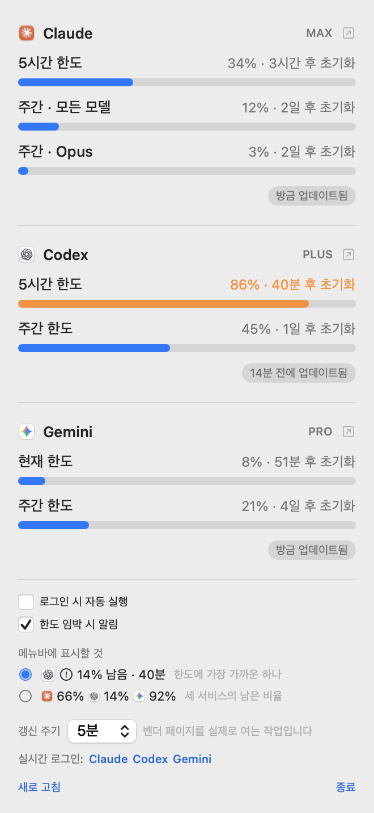
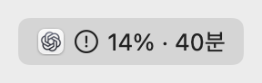

<div align="center">


# TokenUsage

**Claude · Codex · Gemini 한도를 메뉴바에서 항상 최신으로.**

[](LICENSE)


[](https://github.com/dongha0312/TokenUsage/actions/workflows/ci.yml)

<picture>
  <source media="(prefers-color-scheme: dark)" srcset="docs/panel-ko-dark.png">
  
</picture>

</div>

---

접힌 상태에서는 **5시간 한도** 중 가장 많이 쓴 것을 보여줍니다. 지금 당장 나를 막는 건
그쪽이기 때문입니다.

<picture>
  <source media="(prefers-color-scheme: dark)" srcset="docs/menubar-urgent-ko-dark.png">
  
</picture>

세 서비스를 한 번에 보고 싶으면 이렇게도 됩니다.

<picture>
  <source media="(prefers-color-scheme: dark)" srcset="docs/menubar-all-ko-dark.png">
  
</picture>

모든 수치는 각 벤더의 사용량 페이지에서 그대로 가져옵니다. **추정값이 없습니다.**
UI는 시스템 언어를 따릅니다(한국어·영어).

---

## 시작하기

### 1. 준비물

- **macOS 14 (Sonoma) 이상**
- **Xcode** — 소스에서 직접 빌드할 때만 필요합니다.
  [App Store에서 무료](https://apps.apple.com/app/xcode/id497799835)이고
  **유료 개발자 계정은 필요 없습니다.**
- Claude / ChatGPT(Codex) / Gemini 구독 중 하나 이상. 로그인한 것만 표시됩니다.

명령줄 도구가 설치돼 있는지 확인하세요.

```sh
xcode-select --install     # 이미 설치돼 있다는 메시지가 나오면 넘어가세요
```

### 2. 앱 받기

**가장 쉬운 방법:** [Releases](https://github.com/dongha0312/TokenUsage/releases) 에서
`.dmg` 를 받아 Applications 로 끌어다 놓으세요. Xcode 가 필요 없습니다.

직접 빌드하려면:

```sh
git clone https://github.com/dongha0312/TokenUsage.git
cd TokenUsage
./build.sh --install
```

빌드 → `/Applications` 설치 → 실행까지 한 번에 됩니다. 첫 빌드는 1~2분, 이후는 빠릅니다.

이제 메뉴바에 `—` 가 뜹니다. 아직 데이터가 없어서 그렇습니다. 다음 단계로 갑니다.

<details>
<summary>Xcode 없이 빌드하려면</summary>

```sh
NO_XCODE=1 ./build.sh --install
```

SwiftPM만 씁니다. **알림만 빼고** 전부 동작합니다 — macOS가 손으로 조립한 번들을 알림센터에
등록해주지 않습니다. 메뉴바 경고 표시는 그대로 동작합니다.
</details>

<details>
<summary>서명 인증서가 없다고 나오면</summary>

`build.sh` 가 인증서를 자동으로 찾아 씁니다. 하나도 없으면 서명 없이 빌드한 뒤 ad-hoc 서명을
붙입니다 — 앱은 정상 실행되고 알림만 못 씁니다. 특정 팀으로 서명하려면:

```sh
TEAM_ID=팀ID ./build.sh --install
```
</details>

### 3. 서비스별 로그인 (한 번만)

메뉴바 아이콘을 클릭하면 패널 맨 아래에 이 줄이 있습니다.

```
실시간 로그인:  Claude  Codex  Gemini
```

각 이름을 클릭하면 해당 벤더의 사용량 페이지 창이 열립니다. 거기서 로그인하세요.

- 로그인에 성공하면 그 줄에서 이름이 사라집니다.
- 5분 안에(또는 **새로 고침** 클릭) 숫자가 채워집니다.
- **한 번만 하면 됩니다.** 앱이 자체 쿠키를 보관해서 재시작·재빌드해도 유지됩니다.

> **구글 로그인이 막히면?** 구글은 앱 내장 웹뷰에서의 OAuth를 차단합니다.
> "이 브라우저 또는 앱은 보안 요건을 충족하지 않을 수 있습니다"가 뜨면
> **이메일 + 인증 코드** 방식으로 로그인하세요. 같은 계정이고 웹뷰에서 잘 됩니다.

> **왜 크롬 로그인을 못 쓰나요?** 앱 웹뷰는 크롬·사파리와 완전히 분리된 쿠키 저장소를 씁니다.
> 브라우저 쿠키를 읽어오는 건 자격증명을 직접 만지는 일이라, 이 앱이 하지 않는 선입니다.

### 4. 원하는 대로 설정

패널 안에 다 있습니다.

| 항목 | 설명 |
|---|---|
| **메뉴바에 표시할 것** | 한도에 가장 가까운 하나만, 또는 세 서비스 전부. 각 선택지가 지금 내 실제 수치로 미리보기를 보여줘서, 고르기 전에 어떻게 될지 알 수 있습니다. |
| **갱신 주기** | 2 / 5 / 15 / 30분. 갱신할 때마다 벤더 페이지를 실제로 열기 때문에 짧게 잡는 게 공짜는 아닙니다. 바꾸면 즉시 한 번 갱신합니다. |
| **로그인 시 자동 실행** | 부팅 시 자동 시작. 기본 켜짐. 끄면 계속 꺼진 상태로 둡니다. |
| **한도 임박 시 알림** | 어느 한도든 80%, 95%를 넘으면 알림. |
| **새로 고침** | 지금 즉시 전부 다시 읽기. 몇 초 걸리고 진행 상황이 표시됩니다. |
| **제공자 수치 부분 클릭** | 그 벤더의 사용량 페이지를 실제 브라우저로 엽니다. 앱 숫자와 대조할 때. ↗ 가 표식입니다. |
| **종료** | 앱 끄기. |

---

## 패널 읽는 법

```
[아이콘] Claude                             PLAN  ↗
```
제공자 · 플랜 배지 · 벤더 페이지 열기 버튼.

```
5시간 한도                     34% · 3시간 후 초기화
▇▇▇▇▇▇▇▇▇▇▇▇▇▇▇░░░░░░░░░░░░░░░░░░░░░░░░░░░░░░░░
```
한도 창마다 한 줄. 퍼센트는 **사용한 비율**입니다 — 벤더가 보고하는 방향 그대로라
그쪽 화면과 바로 대조됩니다. 막대는 평소 파랑, 80% 넘으면 주황, 95% 넘으면 빨강.

```
                                   방금 업데이트됨
```
이 수치가 언제 기준인지. 실시간 조회가 실패하면 로컬 값으로 떨어지고
**"로컬 값 표시 중"** 이라고 밝힙니다 — 오래된 숫자를 현재값인 척 보여주지 않습니다.

**메뉴바 자체가 경고합니다.** 80%를 넘으면 아이콘 옆에 경고 표시가, 95%를 넘으면 채워진
삼각형이 뜹니다. 권한이 필요 없어서 어떤 빌드에서도 동작합니다.

---

## 수치의 출처

| | 창 | 출처 | 갱신 |
|---|---|---|---|
| **Claude** | 5시간 · 주간 · 주간(모델별) | `claude.ai/settings/usage` (숨은 웹뷰) | 5분 |
| | *폴백* | `~/.claude.json` 의 `cachedUsageUtilization` | `/usage` 실행 시에만 |
| **Codex** | 5시간 · 주간 | `chatgpt.com/codex/.../analytics#usage` (숨은 웹뷰) | 5분 |
| | *폴백* | `~/.codex/sessions/**/*.jsonl` 의 `rate_limits` | Codex 쓸 때마다 |
| **Gemini** | 현재 · 주간 | `gemini.google.com/usage` (숨은 웹뷰) | 5분 |

아이콘은 맥에 설치된 앱(Claude.app · ChatGPT.app · Gemini.app)에서 `NSWorkspace` 로
가져옵니다. 로고 이미지를 번들에 넣지 않습니다. 앱이 없으면 짧은 글자로 대체됩니다.

## 개인정보

**이 앱은 자격증명을 읽지 않습니다.** Keychain 접근 없음, OAuth 토큰 추출 없음,
자체 서버 없음.

- Claude·Codex는 그 도구들이 이미 써둔 로컬 파일을 폴백으로 읽습니다.
- 실시간 값은 숨은 `WKWebView` 가 벤더의 사용량 페이지를 띄워서 읽습니다.
  앱 안에서 로그인하고, 웹뷰가 자기 쿠키를 갖습니다. 앱은 렌더된 텍스트만 읽습니다.

수집·전송하는 데이터가 없습니다. 네트워크는 저 세 페이지를 여는 것뿐입니다.

---

## 문제 해결

**메뉴바에 `—` 만 보입니다**
아직 데이터가 없습니다. 패널 아래 "실시간 로그인"에서 로그인하세요.

**"○○ 로그인 필요" 라고 나옵니다**
세션이 만료됐습니다. 그 줄에서 제공자 이름을 눌러 다시 로그인하세요.

**"수치를 못 읽음" 이라고 나옵니다**
벤더가 페이지 구조를 바꿔서 파서를 고쳐야 합니다.
[이슈로 알려주세요](https://github.com/dongha0312/TokenUsage/issues) —
아래 진단 모드 출력을 같이 올려주시면 실제로 뭐가 렌더됐는지 보입니다.

**알림이 안 옵니다**
Xcode 빌드여야 하고, 번들 ID에 거부 이력이 없어야 합니다. macOS는 거부된 식별자를 기억하고
재서명으로는 지워지지 않습니다. 포크하셨다면 프로젝트의 `PRODUCT_BUNDLE_IDENTIFIER` 를
본인만의 값으로 바꾸고 다시 빌드하세요. 알림을 못 쓰는 상황이면 체크박스가 스스로 비활성이
되고 사유를 표시합니다.

**재빌드했더니 다시 로그인하라고 합니다**
번들 ID가 바뀌었습니다. `WKWebsiteDataStore` 가 식별자별로 분리돼서 로그인은
`~/Library/WebKit/<번들ID>/` 에 있습니다. 그 디렉터리와
`~/Library/HTTPStorages/<번들ID>.binarycookies` 를 새 식별자 이름으로 옮기면 세션이 따라옵니다.

### 진단 모드

메뉴바 앱은 stdout이 없고 `NSLog` 도 `log show` 에 안 잡혀서 실패가 눈에 안 보입니다.

```sh
pkill -x TokenUsage
TOKENUSAGE_DEBUG=1 /Applications/TokenUsage.app/Contents/MacOS/TokenUsage &
cat /tmp/tokenusage-debug.log
```

제공자별 조회 시간과 파싱된 값, 실패 시 도달한 URL과 렌더된 내용 일부가 남습니다.
환경변수를 안 주면 아무것도 쓰지 않습니다.

---

## 설계 노트

만들면서 틀렸던 것과 그걸 어떻게 알았는지는 **[DEVLOG.md](DEVLOG.md)** 에 정리해뒀습니다.
아래는 요약입니다.

### 비율은 "남은 양"이 아니라 "사용한 양"
세 벤더 모두 사용량 기준으로 보고합니다. 뒤집으면 벤더 화면과 대조할 때마다 헷갈립니다.

### 굳은 수치를 현재값인 양 보여주지 않는다
모든 출처가 "어느 시점의 스냅샷"입니다. 그래서 리셋이 지난 창은 비우고, 제공자마다 언제
기준인지 표시하고, 실패 시 로컬로 떨어지되 그 사실을 밝힙니다.

### 파서는 문구가 아니라 의미를 넘긴다
파서는 `WindowKind.session(hours:)` / `.weeklyScoped("Fable")` 을 돌려주지, 완성된 문자열을
만들지 않습니다. 벤더 페이지는 **계정** 언어를, UI는 **시스템** 언어를 따르므로 분리해야
합니다. 모르는 종류는 버리지 않고 통과시켜서, 벤더가 새 한도를 추가해도 표시됩니다.

### 날짜 형식 하나에 기능 전체를 걸지 않는다
퍼센트는 숫자라 언어를 안 타지만 리셋 시각은 `2026. 9. 19. 오후 9:57` 처럼 지역 형식입니다.
웹에서 날짜를 못 읽으면 로컬 로그의 epoch로 채웁니다.

### Claude: 역산을 만들었다가 지운 이야기
처음엔 JSONL의 토큰을 5시간 블록으로 묶고 실제 429 기록에서 한도를 역산했습니다.
실물 `/usage` 와 대조하니 **2배 빗나갔습니다**(역산 한도가 실제의 절반). 창 시작점도 주간 앵커도
틀렸고요. 그 기계 전체를 JSON 키 하나 읽는 것으로, 다시 실시간 웹으로 대체했습니다.
ClaudeReader 290줄 → 127줄, 테스트 22초 → 0.05초.

## 알려진 한계

- **웹 파싱은 렌더된 텍스트를 읽습니다.** 벤더가 페이지를 바꾸면 깨지고, 로컬 폴백이 있으면
  그쪽으로 떨어집니다. Claude 파서는 한국어·영어를 받고, Gemini는 `hl=en` 으로 고정했습니다.
- **Gemini는 폴백이 없습니다.** 로컬에 아무것도 없어서 로그인 전에는 비어 있습니다.
- **Codex 로컬 폴백은 이 맥의 세션만 반영합니다.** 웹 경로가 있는 이유가 그것입니다.
  단일 기기 계정에서는 로컬과 웹이 정확히 일치하는 걸 확인했습니다.
- **메모리 약 100MB.** WKWebView를 한 번 쓰면 WebKit이 프로세스에 남습니다. 웹뷰 자체는
  조회할 때만 만들고 버려서 유휴 시 보조 프로세스는 0개입니다.

## 개발

```sh
swift test                                  # 91개
open Package.swift   # SwiftPM으로 Xcode에서 열기
```

`RealDataTests` 는 실제 디스크 파일로 리더를 돌리고, 파일이 없으면 건너뜁니다.
단위 테스트는 제가 만든 샘플만 검증하므로, 진짜 포맷과 어긋나는 건 여기서만 잡힙니다.

기여 환영합니다 — 특히 벤더가 페이지를 바꿨을 때의 파서 수정과,
영어·한국어 외 번역(`Sources/UsageCore/L10n.swift`)이요.

## 라이선스

MIT — [LICENSE](LICENSE) 참고.

<div align="center">

**[English README](README.md)**

</div>
