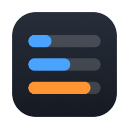
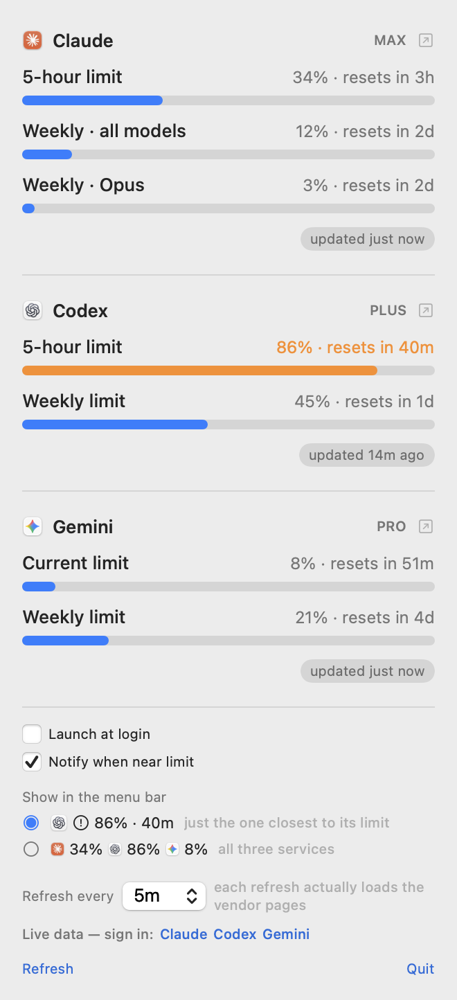
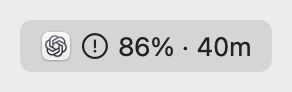
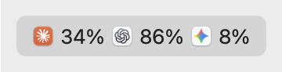

<div align="center">



# TokenUsage

**Your Claude, Codex and Gemini limits — in the menu bar, always current.**

[](LICENSE)


[](https://github.com/dongha0312/TokenUsage/actions/workflows/ci.yml)

<picture>
  <source media="(prefers-color-scheme: dark)" srcset="docs/panel-en-dark.png">
  
</picture>

</div>

---

Collapsed, the menu bar shows the **5-hour limit** closest to running out — the one that can
actually block you right now:

<picture>
  <source media="(prefers-color-scheme: dark)" srcset="docs/menubar-urgent-en-dark.png">
  
</picture>

Or all three at once, if you'd rather see everything:

<picture>
  <source media="(prefers-color-scheme: dark)" srcset="docs/menubar-all-en-dark.png">
  
</picture>

Every number comes from the vendor's own usage page. **Nothing is estimated.** The UI follows
your system language (English and Korean).

---

## Getting started

### 1. What you need

- **macOS 14 (Sonoma) or newer**
- **Xcode** — [free on the Mac App Store](https://apps.apple.com/app/xcode/id497799835).
  Needed to build. You do *not* need a paid Apple Developer account.
- At least one of: a Claude subscription, a ChatGPT/Codex subscription, a Gemini
  subscription. The app shows whichever you are signed in to.

Check Xcode's command line tools are set up:

```sh
xcode-select --install     # skip if it says they're already installed
```

### 2. Get the code and build

```sh
git clone https://github.com/dongha0312/TokenUsage.git
cd TokenUsage
./build.sh --install
```

That builds the app, copies it to `/Applications`, and launches it. The first build takes a
minute or two; later ones are quick.

You should now see a small item in your menu bar showing `—`. It has no data yet — that's the
next step.

<details>
<summary>Building without Xcode</summary>

```sh
NO_XCODE=1 ./build.sh --install
```

Uses SwiftPM only. Everything works except notifications — macOS refuses to register a
hand-assembled bundle with Notification Center. The menu bar warning glyph still works.
</details>

<details>
<summary>"No signing certificate" or build fails on signing</summary>

`build.sh` looks for a signing certificate and uses it automatically. If you have none, it
builds unsigned and applies an ad-hoc signature — the app still runs, you just can't use
notifications. To use a specific team:

```sh
TEAM_ID=YOURTEAMID ./build.sh --install
```
</details>

### 3. Sign in to each service (once)

Click the menu bar item. At the bottom of the panel you'll see:

```
Live data — sign in:  Claude  Codex  Gemini
```

Click each name, sign in the window that opens, and it closes itself when it succeeds. Names
disappear from that line as each one connects.

**You do this once.** The app keeps its own cookies and remembers you across restarts and
rebuilds.

> [!TIP]
> **Signing in with Google?** Google blocks its OAuth flow inside embedded web views. If you
> see "This browser or app may not be secure", use the **email + verification code** option
> instead — same account, and it works.

> [!NOTE]
> **It can't reuse your browser's login.** The app's web views have their own cookie store,
> separate from Chrome or Safari. Reading your browser's cookies would mean touching your
> credentials directly, which this app deliberately never does.

### 4. Set it up the way you want

Everything is in the panel:

| Control | What it does |
|---|---|
| **Show in the menu bar** | Either the one limit closest to running out, or all three side by side. Each option previews itself using your live numbers, so you can see what you'd get before picking. |
| **Refresh every** | 2 / 5 / 15 / 30 minutes. Each refresh actually loads the vendor pages, so shorter isn't free. Changing it refreshes immediately. |
| **Launch at login** | Starts the app automatically. On by default. Turn it off and it stays off. |
| **Notify when near limit** | A notification at 80% and again at 95% of any limit. |
| **Refresh** | Re-reads everything right now. Takes a few seconds; shows progress. |
| **Clicking a provider's numbers** | Opens that vendor's usage page in your real browser, so you can check the app against the source. The ↗ marks it. |
| **Quit** | Exits. |

---

## Reading the panel

```
[icon] Claude                             PLAN  ↗
```
The provider, its plan badge, and the button to open the vendor's page.

```
5-hour limit                   34% · resets in 3h
▇▇▇▇▇▇▇▇▇▇▇▇▇▇▇░░░░░░░░░░░░░░░░░░░░░░░░░░░░░░░░
```
One row per limit window. The percentage is **how much you have used** — same direction the
vendors report, so it lines up with their own screens. The bar is blue normally, orange past
80%, red past 95%.

```
                                 updated just now
```
When that number is from. If a live fetch fails the app falls back to local data and says
**"showing local data"** — it never shows an old number as if it were current.

**The menu bar itself warns you.** Past 80% a warning glyph appears next to the icon; past 95%
it becomes a filled triangle. This needs no permission and works in every build.

---

## Where the numbers come from

| | Windows | Source | Refresh |
|---|---|---|---|
| **Claude** | 5-hour · weekly · weekly per-model | `claude.ai/settings/usage` (hidden web view) | 5 min¹ |
| | *fallback* | `cachedUsageUtilization` in `~/.claude.json` | only when you run `/usage` |
| **Codex** | 5-hour · weekly | `chatgpt.com/codex/.../analytics#usage` (hidden web view) | 5 min |
| | *fallback* | `rate_limits` in `~/.codex/sessions/**/*.jsonl` | whenever you use Codex |
| **Gemini** | current · weekly | `gemini.google.com/usage` (hidden web view) | 5 min |

¹ Adjustable in the panel.

Provider icons come from the apps installed on your Mac (Claude.app, ChatGPT.app, Gemini.app)
via `NSWorkspace` — no bundled logo images. If an app isn't installed you get a short label
instead.

## Privacy

**The app never reads your credentials.** No Keychain access, no OAuth token extraction, and
no server of its own.

- Claude and Codex fall back to reading local files those tools already wrote.
- For live data, a hidden `WKWebView` loads the vendor's own usage page. You sign in inside the
  app; the web view keeps its own cookies. The app reads only the rendered text.

No telemetry. The only network traffic is loading those three pages.

---

## Troubleshooting

**The menu bar shows `—`**
Nothing has data yet. Sign in via "Live data — sign in" at the bottom of the panel.

**A provider says "sign in to ..."**
Its session expired. Click the provider's name in that line and sign in again.

**A provider says "couldn't read values"**
The vendor changed their page layout and the parser needs updating. Please
[open an issue](https://github.com/dongha0312/TokenUsage/issues) — include the output of the
diagnostic below, which captures what the page actually rendered.

**Notifications don't work**
They need the Xcode build *and* a bundle identifier that has never been rejected. macOS
remembers a rejected identifier and re-signing does not clear it. If you forked this, change
`PRODUCT_BUNDLE_IDENTIFIER` in the project to something unique to you and rebuild. The
checkbox disables itself and explains when notifications aren't available.

**I rebuilt and it asked me to sign in again**
The bundle identifier changed. `WKWebsiteDataStore` is scoped per identifier, so logins live
in `~/Library/WebKit/<bundle-id>/`. Move that directory and the matching
`~/Library/HTTPStorages/<bundle-id>.binarycookies` to the new identifier to carry sessions
across.

### Diagnostic mode

A menu bar app has no stdout, and `NSLog` doesn't reach `log show`, so failures are invisible.

```sh
pkill -x TokenUsage
TOKENUSAGE_DEBUG=1 /Applications/TokenUsage.app/Contents/MacOS/TokenUsage &
cat /tmp/tokenusage-debug.log
```

Logs each provider's fetch duration and parsed values, and on failure the URL it landed on
plus a snippet of what rendered. Writes nothing when the variable is unset.

---

## Design notes

### Percentages are "used", not "left"

All three vendors report how much you have *used*. Flipping it would make every comparison
against the vendor's own screen confusing.

### It never shows a stale number as if it were current

Every source is a snapshot of some moment:

- If `resets_at` has already passed, the window has rolled over — the app shows 0% and no
  countdown, because the next window starts on next use.
- Every provider row shows when its number is from.
- If a live fetch fails, the app falls back to local data and says so.

### Parsers return meaning, not text

A parser returns `WindowKind.session(hours:)` / `.weeklyScoped("Fable")`, never a display
string. The vendor page follows your *account* language; the UI follows your *system*
language. Keeping them separate is what makes both work. Unknown limit kinds pass through
rather than being dropped, so a new limit a vendor adds still shows up.

### Reset times fall back to local data

Percentages are digits and survive any language. Reset times are localized prose
(`2026. 9. 19. 오후 9:57`). When a page's date can't be parsed, the app fills the reset time
from the local log, which stores the same value as an epoch. One date format never breaks the
whole feature.

### Claude: the reverse-engineering that got deleted

The first version summed tokens from `~/.claude/projects/**/*.jsonl` into 5-hour blocks and
inferred the limit from real 429 records, because Anthropic doesn't publish plan limits.

Checked against the real `/usage` screen, it was **off by 2×** (the inferred limit was about half the real one),
and both the window start and the weekly anchor were wrong. All of it — block splitting, limit
calibration, rolling windows, a 324 MB mtime-cached scanner — was replaced by reading one JSON
key, and then by the live page. `ClaudeReader` went from 290 lines to 127, and the test suite
from 22 s to 0.05 s.

The full story, including every bug found and how, is in [DEVLOG.md](DEVLOG.md) (Korean).

## Known limitations

- **Web parsing reads rendered text.** If a vendor changes its page, the parser breaks and the
  app falls back to local data where it exists. The Claude parser handles Korean and English;
  Gemini is pinned to `hl=en`.
- **Gemini has no local fallback.** Nothing about Gemini usage is stored on disk, so it shows
  nothing until you sign in.
- **Codex local data only covers this Mac.** Its session logs don't include usage from other
  devices — that's the only reason the web path exists for Codex. Verified: on a
  single-machine account the local logs match the web exactly.
- **Memory.** WebKit stays loaded in the process once used (~100 MB). Web views themselves are
  created per fetch and torn down after, so no helper processes idle in the background.

## Development

```sh
swift test           # 80 tests
open Package.swift   # work in Xcode via SwiftPM
```

`RealDataTests` runs the readers against the real files on your machine and skips when they're
absent. Unit tests only prove the parser handles the samples I wrote; this is what catches
drift from the real formats.

Contributions welcome — especially parser fixes when a vendor changes their page, and
translations beyond English and Korean. See **[CONTRIBUTING.md](CONTRIBUTING.md)** for how the
code is laid out and the two rules the design leans on.

## License

MIT — see [LICENSE](LICENSE).

<div align="center">

**[한국어 설명서](README.ko.md)**

</div>
